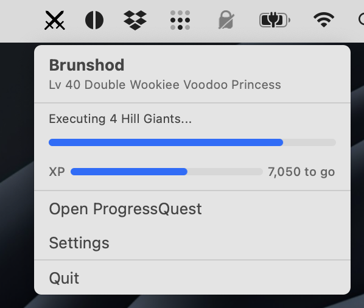
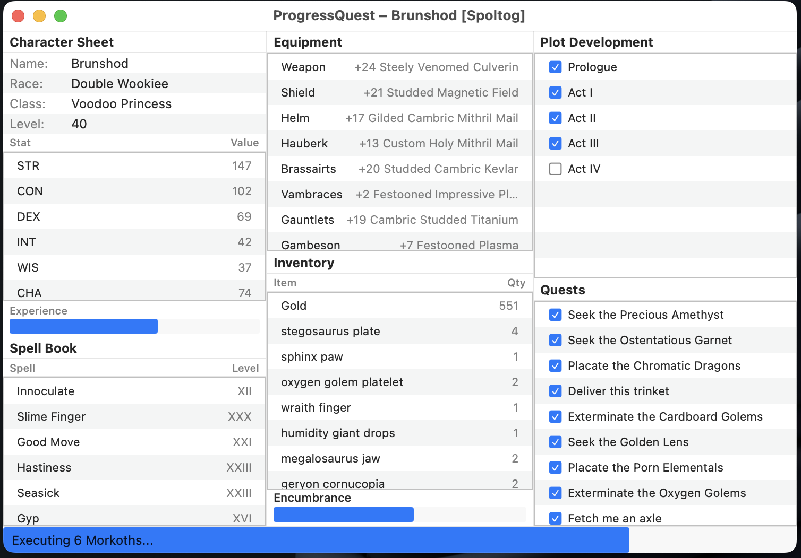

# Progress Quest — Swift Edition

[](https://github.com/meub/pq-swift/releases/tag/v1.0)

A native macOS reimplementation of [Progress Quest](http://progressquest.com/), the original zero-player RPG. Your character automatically fights monsters, completes quests, levels up, and advances through an epic plot — all without any player interaction whatsoever.

**Unofficial macOS Swift Version — Compatible with v6.4.4**

Made with help from [Claude Code](https://claude.ai/code)

## Screenshots

| Menu Bar Popover | Game Window |
|:---:|:---:|
|  |  |

**Menu Bar** — Lives in your menu bar with a compact popover showing character name, level, current task progress, and XP. Quick access to the game window, settings, and quit.

**Game Window** — Classic three-column layout: character sheet with stats and spellbook on the left, equipment and inventory in the middle, plot development and quest log on the right. The bottom status bar tracks your current action in real time.

## Features

### Zero-Effort Gameplay
- Characters fight, loot, level, and quest entirely on their own
- 100ms game loop drives continuous progress through monster encounters, quests, and plot acts
- Dramatic prologue cinematic, multi-step market visits, and act transition sequences

### Menu Bar App
- Runs quietly in your macOS menu bar — no Dock icon
- Click the menu bar icon for a compact status popover showing:
  - Character name, level, race, and class
  - Current task with progress bar
  - XP progress toward next level
- Quick access to the game window, settings, and quit

### Full Game Window
- Classic three-column layout:
  - **Left**: Character sheet, stats (STR/CON/DEX/INT/WIS/CHA/HP/MP), spellbook with Roman numeral levels, experience bar
  - **Middle**: Equipment (11 slots), inventory with quantities, encumbrance bar
  - **Right**: Plot development with completed act checkmarks, quest log (last 20)
- Bottom status bar shows current action ("Executing 3 Kobolds...")

### Procedural Generation
- **270+ monsters** from Bunny to Demogorgon, with level-scaled difficulty modifiers (sick, young, big, special, undead, demon)
- **21 races** — Half Orc, Enchanted Motorcycle, Land Squid, Double Wookiee, and more
- **18 classes** — Ur-Paladin, Voodoo Princess, Robot Monk, Jungle Clown, and more
- **48+ spells** — Slime Finger, Rabbit Punch, Holy Batpole, Animate Nightstand
- Procedurally named equipment with quality modifiers (Polished, Vicious, Dancing, Vorpal, Holy)
- Unique quests and plot acts every playthrough

### Online Multiplayer
- Connect to official Progress Quest servers and join realms
- Browse available realms with descriptions
- Character registration with server-assigned passkey
- Status reports ("brags") sent on level-ups, act completions, and game start
- LFSR authentication compatible with the original Delphi client
- Guild support

### Save System
- **Native JSON format**: `.pq.json` files with complete game state
- **Auto-save**: On level-ups, quest completions, and act transitions to `~/<CharacterName>.pq.json`
- **Legacy support**: Load original Delphi `.pq` binary save files (zlib-compressed DFM format)
- **Content-based format detection**: Automatically detects JSON vs. compressed Delphi vs. raw DFM

### Automatic Backups
- Configurable schedule: Off, Daily, or Weekly
- Timestamped backup files: `CharName - 2026-03-11_14-30-00.pq.json`
- Customizable backup folder (default: `~/Documents/ProgressQuest Backups`)
- Manual "Back Up Now" button in Settings
- Preferences persisted across launches

### Zero Dependencies
- Pure Swift + SwiftUI — no third-party packages
- Single Swift Package Manager target
- Compiles with `swift build`, no Xcode project required

## Requirements

- macOS 14 (Sonoma) or later
- Swift 5.9+

## Install

**[Download the latest DMG](https://github.com/meub/pq-swift/releases/latest/download/ProgressQuest-v1.0.dmg)** from the [Releases](https://github.com/meub/pq-swift/releases) page, open it, and drag ProgressQuest to your Applications folder.

> **Note:** The app is not code-signed. On first launch, right-click the app and choose "Open" to bypass Gatekeeper, or go to System Settings > Privacy & Security and click "Open Anyway".

## Building from Source

```bash
# Clone and build
git clone https://github.com/meub/pq-swift.git
cd pq-swift
swift build

# Run
swift run ProgressQuest

# Or build a release binary
swift build -c release
.build/release/ProgressQuest
```

## How It Works

### Starting a Game

1. Launch the app — it appears in your **menu bar** (not the Dock)
2. Click the icon and choose **Open ProgressQuest**
3. From the title screen, pick:
   - **New Game (Single Player)** — Create a character and play offline
   - **New Game (Multiplayer)** — Register on an official PQ realm
   - **Load Game** — Resume from a `.pq.json` or legacy `.pq` save file
   - **Exit** — Close the window

### Character Creation

- Enter a name or click **Generate** for a procedurally generated one (consonant-vowel-consonant syllable chains)
- Pick a race from 21 options, each with unique stat modifiers
- Pick a class from 18 options, each with unique stat modifiers
- Roll stats: 3d6+3 for STR, CON, DEX, INT, WIS, CHA
- Click **Sold!** to begin your adventure

### Gameplay

Once started, the game runs automatically. Your character will:

1. Experience a dramatic prologue cinematic
2. Head to the killing fields to fight level-appropriate monsters
3. Collect loot, gold, spells, and equipment upgrades
4. Sell excess inventory at the market when encumbered
5. Buy better equipment when gold permits
6. Complete quests and advance through plot acts
7. Level up with stat boosts, new spells, and HP/MP gains

### Saving & Quitting

- Games auto-save to `~/<CharacterName>.pq.json` at key milestones
- Clicking **Quit** in the menu bar saves the game and shows a confirmation with the save file path before exiting

### Settings

Access via the menu bar dropdown:
- View current save file location
- Configure automatic backup schedule (Off / Daily / Weekly)
- Choose a custom backup folder
- See last backup timestamp
- Trigger a manual backup

## Architecture

```
Sources/ProgressQuest/
├── App.swift                — @main entry, menu bar (MenuBarExtra), window scenes
├── FrontView.swift          — Title screen with logo, version info, and action buttons
├── NewCharacterView.swift   — Character creation: name, race, class, stat rolling
├── RealmSelectionView.swift — Multiplayer server browser
├── ContentView.swift        — Main 3-column game view with progress bars
├── SettingsView.swift       — Settings window: save info, backup configuration
├── GameEngine.swift         — Core game logic, all mutable state, save/load, timer tick
├── GameData.swift           — Static data tables (270+ monsters, items, spells, races, classes)
├── Server.swift             — Online play: LFSR auth, realm list, registration, bragging
├── BackupManager.swift      — Scheduled and manual backup system
├── DelphiSaveParser.swift   — Parser for original Delphi binary .pq save files
├── Utilities.swift          — Name gen, roman numerals, English morphology, random helpers
└── Resources/
    ├── pq-logo.png          — Title screen logo
    └── menubar-icon.png     — Menu bar icon
```

### Key Design Decisions

- **`@Observable` GameEngine** — Single source of truth for all game state, driving reactive SwiftUI updates across all views
- **Task queue system** — Cinematic sequences and multi-step actions (market visits, plot transitions) are queued as pipe-delimited strings and dequeued sequentially
- **Timer-driven game loop** — A 100ms repeating `Timer` drives `tick()`, which advances `taskPos` and triggers state transitions (level-ups, quest completions, act transitions)
- **Menu bar as primary UI** — `NSApp.setActivationPolicy(.accessory)` hides from Dock; `MenuBarExtra` with `.window` style provides a compact popover
- **Content-based format detection** — Save files are identified by first byte (`0x7B` = JSON, `0x78` = zlib Delphi, `0x54` = raw TPF0) rather than file extension
- **LFSR authentication** — Implements the original Delphi-compatible Linear Feedback Shift Register hash for signing server requests with `UInt32` truncating arithmetic
- **Level-matched selection** — Monsters and equipment are chosen via best-of-6 random sampling (`lpick()`), keeping the closest match for the player's level

## Online Play

When playing on an official realm, the game:

- Fetches the realm list from `progressquest.com`
- Registers your character with the server and receives a unique passkey
- Reports status updates on level-ups (`"l"`), act completions (`"a"`), and game start (`"s"`)
- Signs all server requests with an LFSR hash for Delphi-compatible authentication
- Uses User-Agent `PQ6.4` to match the original client

## Save Format

### Native Format (`.pq.json`)
JSON files containing the complete `SaveData` struct: character traits, stats, equipment, inventory, spells, quests, plot progress, task queue state, and online credentials (realm, passkey, guild).

### Legacy Format (`.pq`)
Original Delphi binary save files are supported read-only. The parser handles:
- Zlib decompression (2-byte header stripped)
- TPF0 DFM binary format with property tags (vaInt8/16/32/64, vaString, vaBinary, vaIdent, vaFalse/True, vaCollection, vaList, etc.)
- TListView Items.Data blob extraction (captions, subitems, state indices)
- Component-to-field mapping for all 37 game state components

## Credits

- Original [Progress Quest](http://progressquest.com/) by Eric Fredricksen
- Swift reimplementation compatible with PQ v6.4.4 server protocol
